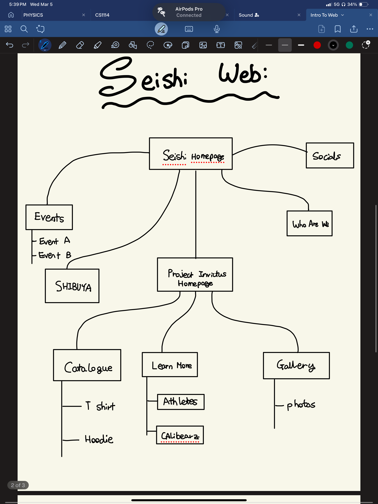
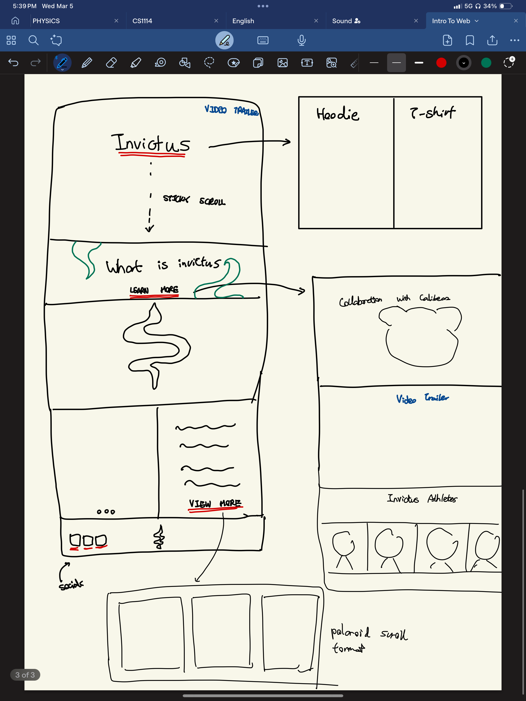

# MIDTERM PROPOSAL 

## BRAND WEBSITE

Description: As part of the marketing scheme for my brand, I am hoping to make a cover menu page for the project which I am currently working on. The title of the project would be called Invictus. I have worked hard on creating renders, product photos and prototypes over the past 3 months for it and what better way is it then to round it up with an exceleent website. I'm planning to launch the website on the 22nd of March which means it perfectly alligns with the midterm dates. Whilst I will only be creating the specific section for this project and not the buisness website entirely the project itself will have a sublinks which branches out into other pages such as Project Information Page, Product Breakdown Page as well as media collection page. 

Below is how I envision this section of the website to look like: 

